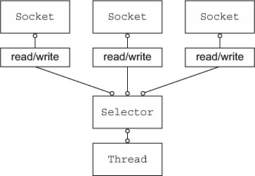
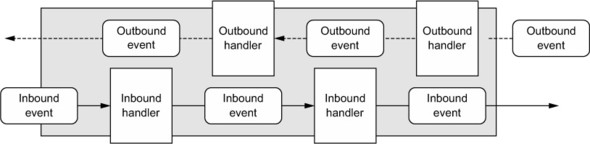

Title: Netty笔记01-Netty简介
Date: 2016-08-05 14:04
Category: Java
Tags: Netty
Author: 刘理想

[TOC]

Netty(http://netty.io )是一个用来快速开发可维护高性能服务器和客户端应用的异步事件驱动网络应用框架。

高性能系统不仅需要我们有优秀的编码技巧，还需要对网络、多线程与并发有相关的经验。

## 1.1 Java网络

早期版本Java的`java.net`支持本地系统的socket库提供的阻塞函数。

- `accept()`一直阻塞直到`ServerSocket`简历了链接，它返回一个`Socket`对象用来在客户端和服务器之间进行通信。
- `BufferedRead`用来从`Socket`中读取文本；`PrintWriter`用来写入。
- `readLine`阻塞直到发送了回车换行

上面的代码每次只能处理一个链接。要管理多个并发的客户端，需要为每一个新的`Socket`来分配一个`Thread`,如图：

我们来思考一下这个方法：
- 首先，很多时间线程处于等待状态，这是一种资源的浪费；
- 每个线程需要在内存上分配64k到1M的空间；
- 即使JVM支持大量的线程，但上下文之间的切换耗时。

### 1.1.1 Java NIO

`setsockopt()`能够配置`sockets`，如果没有数据就立即返回。Java从1.4版开始支持`java.nio`。

### 1.1.2 Selector（选择器）

下图展示了一个非阻塞的设计用来避免前面讲的缺点。

类`java.nio.channels.Selector`是Java非阻塞IO实现的关键。它使用事件通知API来指导`socket`集合。因为可以随时检查每个`socket`的读写完成状态，所以单个线程可以处理多并发连接。

总而言之，这种模型提供了一个比阻塞IO模型更好的资源管理：
- 使用更少的线程来处理多链接，内存和上下文切换开销都更小；
- 当一个线程没有IO操作时可以被重新分配到其他任务上去。

虽然很多应用都直接使用Java NIO API来创建，但要做到正确和安全还是很难。尤其是重负载的情况下处理和分发IO会很麻烦而且容易出错。这就有了高性能网络专家-Netty。

## 1.2 Netty核心组建

- `Channels`
- 回调
- `Futures`
- 事件和handler

这些构建块代表了不同的构造类型：资源、逻辑和通知。

### 1.2.1 Channel

`Channel`是Java NIO的基本构造。

> an open connection to an entity such as a hardware device, a file, a network socket, or a program component that is capable of performing one or more distinct I/O operations, for example reading or writing

可以认为`Channel`是一个用来传输数据的通道，可以被打开、关闭、链接的和断开的

### 1.2.2 回调

Netty使用回调来处理事件。一个回调被触发后，时间可以使用`interface ChannelHandler`的实现来处理。下面的例子是党新链接简历时`ChannelHandler`的回调`channelActive`就会被调用并且打印一个消息。

### 1.2.3 Futures

`Future`提供了另外一种方法用来在操作完成时通知应用。可以把它看成是异步操作返回结果的占位符，只有在将来的某个点完成并且提供结果的存取。

JDK提供了`interface java.util.concurrent.Future`，但提供的实现只允许手工检查操作是否完成或者一直阻塞到完成为止。这种实现很笨拙，Netty提供了自己的实现`ChannelFuture`。

`ChannelFuture`提供了附加的方法，让我们注册一个或多个`ChannelFutureListener`实例。listener(监听器)的回调方法`operationComplete()`在操作完成后背调用。监听器此时可以决定操作是否完成还是有错误。如果是后者，我们能获得一个产生的`Throwable`。简而言之，通知机制通过`ChannelFutureListener`避免了对操作是否完成的手工检查。

Netty的所有outbound IO操作都返回`ChannelFuture`，也就是所都是非阻塞的。

下面展示了`ChannelFuture`	作为IO操作的一部分被返回，这里`connect()`用来直接非阻塞返回，并且将在后台完成。

下面展示了如何利用`ChannelFutureListener`.首先你链接到远程节点(remote peer)。然后对`ChannelFuture`（由`connect()`返回的）注册一个新的`ChannelFutureListener`。如果操作成功，就向`Channel`写数据，否则，会从`ChannelFuture`收到`Throwable`。

如何进行错误的处理完全由你自己定，比如失败时去连接另一个同级节点。

回调和`Future`是整个Netty的核心。

### 1.2.4 事件和handler

Netty使用不同的时间用来通知状态和操作的变化。它允许我们根据不同的事件触发不同的操作。这些动作包括：

- Logging日志
- Data transformation 数据转换
- 流程控制Flow-control
- 应用逻辑Application logic

Netty是一个网络框架，因此它的事件被氛围inbound和outbound相关的数据流。

被inbound数据或相关状态触发的事件有：
- Active或inactive connections
- 读数据(Data read)
- 用户事件(User events)
- 错误事件(Error events)

outbound事件是将来要触发动作的操作结果，可能是：
- 打开或关闭远程peer
- 写或flush数据到socket

时间能够被分发到用户实现的handler类中的方法去。

Netty的`ChannelHandler`提供上图中一些基本的抽象。目前为止，可以把每个handler实例看作是响应里用来处理具体事件的。

### 1.2.5 合在一起

我们讨论了`Future`,回调和`handler`。Netty的异步编程模型建立在`Future`和回调的概念之上的。有了这个之后，我们的应用逻辑可以避免关心这些网络操作概念。这是Netty的设计目标。

截取操作和转换inbound和outbound数据只需要我们提供回调或者利用返回的`Future`。这使得链式操作简单和搞笑，并且提倡书写可重用、泛型代码。

`Selectors`，`Events`和`Event loops`

Netty从应用中通过触发事件、消除所有硬编码分发代码来抽象`Selector`。在内部，`EventLoop`用来复制给每个`Channel`用来处理所有事件，包括：
- 注册感兴趣的事件
- 分发事件到`ChannelHandlers`
- 调度将来的动作

`EventLoop`自身是由单个线程来驱动的，并且在整个生命周期中都不会改变。
