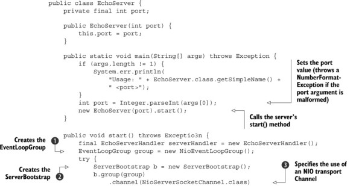
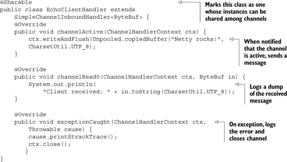

Title: Netty笔记02-第一个Netty应用
Date: 2016-08-08 20:06
Category: Java
Tags: Netty
Author: 刘理想

[TOC]

本章包含：
- 设置开发环境
- 一个Echo服务和客户端
- 构建和测试应用

## 2.1 设置开发环境

下载安装JDK和MAVEN，设置`JAVA_HOME`，并且设置`M2_HOME`

## 2.2 Netty的客户端和服务器概览

下图是我们的Echo服务器和客户端一览。虽然我们大部分是在写web应用，但实现服务器和客户端有助于更好的理解Netty API.


## 2.3 编写Echo服务器

所有的Netty Server都需要：
- **至少一个**`ChannelHandler`:这个组建实现了服务端用于处理客户端提交的数据，它是业务逻辑。
- **Bootstrapping**:用来配置服务的启动代码。最少的启动代码是绑定端口。

### 2.3.1 `ChannelHandler`和业务逻辑

在[上一篇](http://liulixiang1988.github.io/nettybi-ji-01-nettyjian-jie.html)中，我们介绍了`Future`和回调，并且介绍了他们用于事件驱动设计。我们也讨论了`ChannelHandler`，用于接收和响应事件通知。在Netty应用中，所有的数据处理逻辑都是包含在这个核心概念里面的。

因为Echo服务用于响应进来的消息，它需要实现`interface ChannelInboundHandler`，它定义了用于响应`inbound`事件的方法。这个简单的应用只包含几个方法，所以从`ChannelInboundHandlerAdapter`继承就可以了，它是`ChannelInboundHandler`的一个默认实现。

下面的几个方法对我们很有用：
- `channelRead()`：每个incoming消息都会调用
- `channelReadComplete()`: 本批消息中最后一个`channelRead()`被调用时通知
- `exceptionCaught()`:读操作发生异常时会调用。

Echo服务的`ChannelHandler`实现是`EchoServerHandler`，如下：


```java
@ChannelHandler.Sharable
public class EchoServerHandler extends ChannelInboundHandlerAdapter {
    Logger logger = LoggerFactory.getLogger(EchoServerHandler.class);

    @Override
    public void channelRead(ChannelHandlerContext ctx, Object msg) throws Exception {
        ByteBuf in = (ByteBuf) msg;
        logger.info("Server received: {}", in.toString(CharsetUtil.UTF_8));
        ctx.write(in);
    }

    @Override
    public void channelReadComplete(ChannelHandlerContext ctx) throws Exception {
        //flush pending messages to the remote peer and closes the channel
        ctx.writeAndFlush(Unpooled.EMPTY_BUFFER)
                .addListener(ChannelFutureListener.CLOSE);
    }

    @Override
    public void exceptionCaught(ChannelHandlerContext ctx, Throwable cause) throws Exception {
        logger.error("Error: {}, {}", cause.getMessage(), cause.getStackTrace());
        //关闭channel
        ctx.close();
    }
}
```

`ChannelInboundHandlerAdapter`有很只管的API，每个方法都可以被重写。因为你要接受数据，因此需要重写`channelRead()`。

重写`exceptionCaought()`允许你对任何`Throwable`子类型做出响应。

每个`Channel`都有一个`ChannelPipeline`关联，后者有一个`ChannelHandler`实例链。他们一个挨一个的调用。因此如果没有`exceptionCaught()`实现，就回一直传递到`ChannelPipeline`结束，并且被日志记录。因此，在应用中至少有一个`ChannelHandler`提供`exceptionCaught()`。

除了`ChannelInboundHandlerAdapter`之外，还有很多其他`ChannelHandler`子类型。现在只需要知道：
- `ChannelHandler`被不同事件类型调用
- 应用实现或扩展`ChannelHandler`以便在时间不同生命周期挂载并且提供自定义应用逻辑
- 架构上，`ChannelHandler`帮助我们将业务逻辑从网络代码中解耦。

### 2.3.2 Bootstrapping服务

在实现了业务逻辑`EchoServerHandler`之后，现在要启动服务，这包含：

- 绑定端口用来监听请求
- 配置`Channel`用来将`inbound`消息到通知`EchoServerHandler`实例

>**传输**
>传输层是用来提供端到端的通信服务。Internet通信是基于TCP传输的。*`NIO`传输*几乎与TCP等同，只是它使用Java NIO对服务端性能进行了增强。

下面是`EchoServer`类的代码


```java
public class EchoServer {
    private static final Logger logger = LoggerFactory.getLogger(EchoServer.class);
    public final int port;

    public EchoServer(int port){
        this.port = port;
    }

    public static void main(String[] args) throws Exception {
        if (args.length != 1) {
            logger.error("Usage: {} <port>", EchoServer.class.getSimpleName());
            return;
        }
        int port = Integer.parseInt(args[0]);
        new EchoServer(port).start();
    }

    public void start()throws Exception {
        final EchoServerHandler serverHandler = new EchoServerHandler();
        //1. 创建事件循环组
        EventLoopGroup group = new NioEventLoopGroup();
        try {
            //2. 创建ServerBootstrap
            ServerBootstrap b = new ServerBootstrap();
            
            b.group(group)
                    //3. 指定使用NIO传输Channel
                    .channel(NioServerSocketChannel.class) 
                    //4.指定socket端口
                    .localAddress(new InetSocketAddress(port)) 
                    //5. 添加EchoServerHandler到ChannelPipeline
                    .childHandler(new ChannelInitializer<SocketChannel>() {
                        @Override
                        protected void initChannel(SocketChannel socketChannel) throws Exception {
                            //因为EchoServerHandler是@Sharable的,所以我们一直可以使用同一个
                            socketChannel.pipeline().addLast(serverHandler);
                        }
                    });
            //6. 异步绑定,使用sync()等待绑定完成
            ChannelFuture f = b.bind().sync(); 
            //7. 获取Chaneel的CloseFuture,阻塞当前线程,知道其完成
            f.channel().closeFuture().sync();
        } finally {
            //8. 关闭EventLoopGroup,释放所有资源
            group.shutdownGracefully().sync();
        }

    }
}
```

@2中创建了`ServerBootstrap`实例。因为使用的是NIO传输，所以指定`NioEventLoopGroup` @1来接受和处理新的连接，并且使用`NioServerSocketChannel`@3作为channel类型。之后，设置本地地址和端口给`InnetSocketAddress`@4. 服务会丙丁到这个地址监听新的连接请求。

在@5中，创建了一个特殊的类`ChannelInitializer`，这是关键。当接收一个新连接时，一个新的`Channel`子类型会被创建，`ChannelInitializer`会添加一个`DchoServerHandler`的实例到`Channel`的`ChannelPipeline`中。

虽然NIO可扩展，但对它的恰当配置，尤其是多线程配置，却不容易。Netty封装了这些复杂性。

然后我们绑定服务@6， 登台绑定完成（`sync()`调用一起当前`Thread`阻塞直到完成）。在@7中，应用汇等待，直到服务的`Channel`关闭（因为调用了`Channel`的`CloseFuture`的`sync()`）。然后可以关闭`EventLoopGroup`并且释放资源（包括所创建的线程）@8

这里使用NIO时因为它是目前应用最广泛的传输，得益于它的扩展性和异步性。但是也可以使用别的传输实现。如果你想在服务端使用OIO传输，那就指定`OioServerSocketChannel`和`OioEventLoopGroup`。

同时，我们回顾一下服务端实现的重要步骤。下面的是服务端的基础代码。

- `EchoServerHandler`实现业务逻辑
- `main()`方法启动服务

启动服务的步骤：

- 创建`ServerBootstrap`实例
- 创建`NioEventLoopGroup`实例用来处理事件，比如接收新连接，并且读写数据
- 指定本地`InetSocketAddress`用来做服务绑定
- 为每一个`Channel`使用`EchoServerHandler`实例初始化
- 调用`ServerBootstrap.bind()`绑定到服务。

至此，服务被初始化并且处于可用状态了。下一节我们实现客户端应用。

## 2.4 实现Echo客户端

Echo客户端将：

- 连接服务
- 发送一个或多个消息
- 对于每个消息，等待并接受服务器返回
- 关闭连接

服务端同样需要两步：业务逻辑和bootstrap

### 2.4.1 使用`ChannelHandler`实现客户端逻辑

客户端也使用`ChannelInboundHandler`来处理数据。这个例子中，我们扩展类`SimpleChannelInboundHandler`来处理所有的任务。这需要重写以下的方法：

- `channelActive()`：与服务的链接建立后调用
- `channelRead0()`: 从服务端读取到消息后调用
- `exceptionCaught()`: 如果发生异常时调用



```java
@ChannelHandler.Sharable
public class EchoClientHandler extends SimpleChannelInboundHandler<ByteBuf> {
    private static final Logger logger = LoggerFactory.getLogger(EchoClientHandler.class);

    @Override
    public void channelActive(ChannelHandlerContext ctx) throws Exception {
        //当链接建立时调用,发送消息
        ctx.writeAndFlush(Unpooled.copiedBuffer("Netty rocks!", CharsetUtil.UTF_8));
    }

    protected void channelRead0(ChannelHandlerContext ctx, ByteBuf msg) throws Exception {
        //记录收到的消息
        logger.info("Client received: {}", msg.toString(CharsetUtil.UTF_8));
    }

    @Override
    public void exceptionCaught(ChannelHandlerContext ctx, Throwable cause) throws Exception {
        logger.error("Error: {}, {}", cause.getMessage(), cause.getStackTrace());
        ctx.close();
    }
}
```

当有数据从服务端返回时调用`channelRead0()`。注意服务端返回的数据可能是分块的。也就是说，如果服务器返回5个字节，并不能保证5各字节一次性杯接收。及时如此小的数据，`channelRead0()`也有可能被调用两次，第一次用`ByteBuf`（Netty的`byte`容器）保存3个字节，第二个用`ByteBuf`保存2个字节。作为一个流协议，TCP保证每个字节按顺序接收。

**SimpleChannelInboundHandler vs ChannelInboundHandler**

在客户端，当`channelRead0()`完成，你就有了incoming消息。当方法返回时，`SimpleChannelInboundHandler`负责释放`ByteBuf`的内存。

在服务端，你也要响应incoming消息，然后使用`write()`（它是异步的），但当`channelRead()`返回时操作还可能没完成。因此，`EchoServerHandler`继承`ChannelInboundHandlerAdapter`，它不负责释放消息。消息由`EchoServerHandler`的`channelReadComplet()`中`writeAndFlush()`释放。

### 2.4.2 启动客户端


```java
public class EchoClient {
    private static final Logger logger = LoggerFactory.getLogger(EchoClient.class);
    private final String host;
    private final int port;

    public EchoClient(String host, int port) {
        this.host = host;
        this.port = port;
    }

    public void start() throws Exception {
        EventLoopGroup group = new NioEventLoopGroup();
        try {
            Bootstrap b = new Bootstrap();
            b.group(group)
                    .channel(NioSocketChannel.class)
                    .remoteAddress(new InetSocketAddress(host, port))
                    .handler(new ChannelInitializer<SocketChannel>() {
                        protected void initChannel(SocketChannel ch) throws Exception {
                            ch.pipeline().addLast(new EchoClientHandler());
                        }
                    });
            ChannelFuture f = b.connect().sync();
            f.channel().closeFuture().sync();
        } finally {
            group.shutdownGracefully().sync();
        }
    }

    public static void main(String[] args) throws Exception {
        if (args.length != 2) {
            logger.error("Usage: {} <host> <port>", EchoClient.class.getSimpleName());
            return;
        }
        String host = args[0];
        int port = Integer.parseInt(args[1]);
        new EchoClient(host, port).start();
    }
}
```

## 2.5 启动运行Server/Client

### 2.5.1 构建

```
mvn clean package
```

### 2.5.2 运行Echo Server和Client

你可以直接使用Java命令行直接运行，也可以在pom中使用`exec-maven-plugin`插件来配置。

打开两个窗口，分别切换到server和client对应的目录，然后运行:
```
mvn exec:java
```

源码：https://github.com/liulixiang1988/javademo/tree/master/netty/EchoNetty

