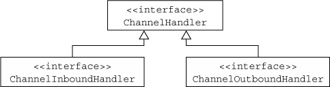
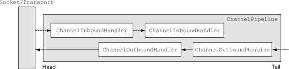

Title: Netty笔记03-Netty组件和设计
Date: 2016-08-09 12:49
Category: Java
Tags: Netty
Author: 刘理想

[TOC]

本章包含：

- Netty的技术与架构
- `Channel`, `EventLoop`, 和 `ChannelFuture`
- `ChannelHandler` 和 `ChannelPipeline`
- Bootstrapping

## 3.1 Channel, EventLoop和ChannelFuture

`Channel`, `EventLoop`和`ChannelFuture`可以看成是Netty对网络的抽象：

- `Channel`:`Socket`
- `EventLoop`: 控制流、多线程和并发
- `ChannelFuture`：异步通知

### 3.1.1 Channel接口

基本IO操作(`bind()`, `connect()`, `read()`, `write()`)依赖于底层网络传输。在基于Java的网络中，基础组成是`Socket`类。Netty的`Channel`接口提供了的API能大幅度减少直接操作`Socket`的复杂度。此外，`Channel`是所有扩展类的根类。下面是一些继承的类：

- `EmbeddedChannel`
- `LocalServerChannel`
- `NioDatagramChannel`
- `NioSctpChannel`
- `NioSocketChannel`

### 3.1.2 EventLoop接口

`EventLoop`定义了Netty对连接生命区间事件处理的核心抽象。在后面的章节里我们会讨论`EventLoop`的细节。下图展示了`Channel`, `EventLoop`, `Thread`和`EventLoopGroup`之间的关系。

关系是：

- 一个`EventLoopGroup`包含一个或多个`EventLoop`
- `EventLoop`在其生命周期内绑定到单个`Thread`
- 所有的IO事件由`EventLoop`在其专属`Thread`内处理
- `Channel`注册到一个`EventLoop`内
- 一个`EventLoop`可以关联多个`Channel`

注意，这个实际中，对于给定`Channel`的IO操作都是在同一个线程内执行的，这样可以避免同步问题。

### 3.1.3 ChannelFuture接口

Netty中所有的操作都是异步的。因为操作不一定能立即返回，因此我们需要一个方法来在后期获取结果。Netty提供了`ChannelFuture`,它的`addListener()`方法注册了`ChannelFutureListener`用来在操作完成后发出通知。

后面我们会深入讨论`EventLoop`和`EventLoopGroup`

## 3.2 Channelhandler和ChannelPipeline

下面我们来详细讨论如何管理数据流和执行应用处理逻辑。

### 3.2.1 ChannelHandler接口

从开发者角度看，Netty的最基本构建式`ChannelHandler`，它包含着用来处理inbound和outbound数据的逻辑。这是因为`ChannelHandler`方法由网络事件触发。事实上，`ChannelHandler`几乎可以用来黑醋栗任何类型的动作，比如数据转换和异常处理。

例如，`ChannelInboundHandler`是经常实现的子接口。这个类型接收inbound事件和数据用于处理业务逻辑。也可以从`ChannelInboundHandler`中将数据作为响应flush给客户端。应用的业务逻辑通常分布在多个`ChannelInboundHandler`中。

### 3.2.2 ChanelPipeline接口

`ChannelPipeline`提供了`ChannelHandler`链的容器，并且定义了API用来在链上传递inbound和outbound事件。当有`Channel`创建时，它会自动的赋值给它的`ChannelPipeline`。

`ChannelHandler`安装到`ChannelPipeline`的过程：

- `ChannelInitializer`被注册到`ServerBootstrap`
- 调用`ChannelInitializer.initChannel()`时，`ChannelInitializer`安装一系列自定义的`ChannelHandler`到pipeline中
- `ChannelInitializer`将自己从`ChannelPipeline`中删除

`ChannelHandler`可以看作是一个通用容器用来处理时间和数据。

`ChannelPipeline`中`ChannelHandler`的执行顺序按照他们加入到链中的顺序。

对于客户端来说，outbound是从客户端到服务器的方向，inbound则相反。

上图也说明inbound和outbound可以添加到同一个pipeline中。如果读取到一个消息，它会从pipeline头开始，并且传递给第一个`ChanneiInboundHandler`。这个handler可能修改也可能不修改数据，之后再将数据传递给下一个`ChannelInboundHandler`。最后数据到达pipeline的尾部，所有的处理会被终止。

outbound数据流动先从尾部开始，直到到达到头部，此时，outbound数据到达网络传输，这里是一个`Socket`。

**更多关于inbound和outbound handler**

时间可以通过每个方法的`ChannelHandlerContext`方法进行向前传递。有时你想忽略一些不感兴趣的事件，Netty提供了抽象基础类`ChannelInboundHandlerAdapter`和`ChannelOutboundHandlerAdapter`。每一个都提供了一个实现，用于将事件传递给下一个handler。我们可以扩展这个类，重写感兴趣的方法。

虽然inbound和outbound handler都继承自`ChannelHandler`, Netty还是会区分`ChannelInboundHandler`和`ChannelOutboundHandler`，并且确保数据只在同一类型的handler间传递。

当`ChannelHandler`添加到`ChannelPipeline`中时，它也被传递了一个`ChannelHandlerContext`参数。这个参数代表着`ChannelHandler`和`ChannelPiepline`之间的一个绑定。虽然这个对象可以被用于获取底层的`Channel`，但更多的是用来写outbound数据。

Netty中有两种方法用来发送数据。你可以直接向`Channel`或者与`ChannelHandler`关联的`ChannelHandlerContext`对象中写数据。前者由`ChannelPipeline`的尾部开始消息，后者由`ChannelHandlerPipeline`的下一个handler开始消息。

### 3.2.3 ChannelHandler

Netty以多种adpater类实现的默认handler。常用的adapter有：

- `ChannelHandlerAdapter`
- `ChannelInboundHandlerAdapter`
- `ChannelOutboundHandlerAdapter`
- `ChannelDuplexHandlerAdapter`

线面我们来看看`ChannelHandler`子类型：encoder, decoder, `SimpleChannelInboundHandler<T>`(`ChannelInboundHandlerAdapter`的子类型)

### 3.2.4 Encode和Decoder

当Netty发送或者接受消息时，数据会发生转换。inbound消息会被decode，也就是会从bytes到其他格式，一般是Java对象。outbound消息会被从当前格式转换到bytes格式，这是encode。这是因为网络数据的传输都是bytes格式。

许多抽象类用来做encoder和decoder. 一般来说，基本类型都会有类似`ByteToMEssageDecoder`或者`MessageToByteEncoder`的名字。

Netty提供的所有的encoder/decoder adapter类都实现了`ChannelInboundHandler`或`ChannelOutboundHandler`。

对于inbound数据，`channelRead`方法/事件会被重写。这个方法会会调用`decode`方法，并且将decoded bytes传递给后面的`ChannelInboundHandler`。

outbound消息于此相反。

### 3.2.5 抽象类SimpleChannelInboundHandler

应用中常用的场景是解析消息，对数据执行逻辑。要创建这样一个`ChannelHandler`，只需要继承`SimpleChannelInboundHandler<T>`，其中`T`是想要处理的消息类型。在这个handler中，重写一个或多个方法，并且获取`ChannelHandlerContext`引用。

在这种类型场景下，最重要的方法是`channelRead0(ChannelHandlerContext, T)`。

## 3.3 Bootstrapping

Netty的bootstrap类提供了为应用网络层配置的容器。包含配置端口、主机地址等。

有两种类型的bootstrap，一种用于客户端(`Bootstrap`)，一种鱼鱼服务端(`ServerBootstrap`)。

类别|Bootstrap|ServerBootstrap
--|--|--
网络功能|连接远程主机和端口|绑定到本地端口
EventLoopGroup数量|1|2

启动一个客户端只需要一个`EventLoopGroup`，但是`ServerBootStrap`却需要两个。这是因为服务端需要两个不同集合的`Channel`，第一个包含一个单独的`ServerChannel`来代表服务器本身监听的socket。第二个集合代表用于处理客户端请求的`Channel`。

与`ServerChannel`关联的`EventLoopGroup`分配一个`EventLoop`用来负责为连接请求创建`Channel`。一旦接受了连接请求，第二个`EventLoopGroup`分配一个`EventLoop`给`Channel`。

## 3.4 总结

本章主要讨论了Netty的技术和架构。详细回顾了`ChannelHandler`, `ChannelPipeline`和bootstrapping.

后续章节会深入讨论这些。

